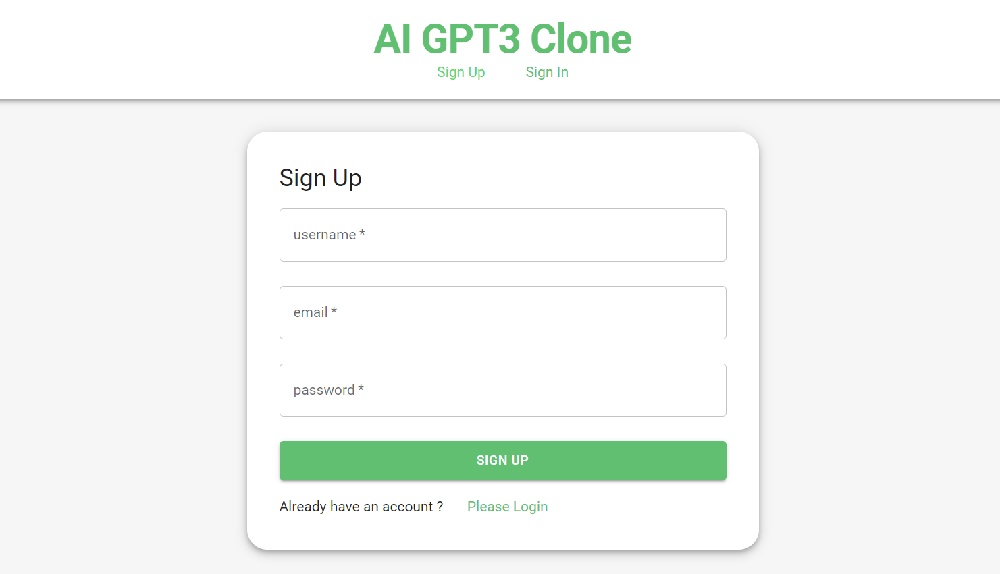
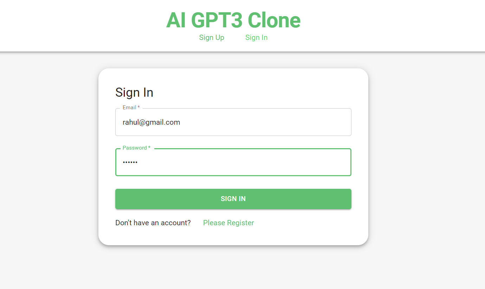
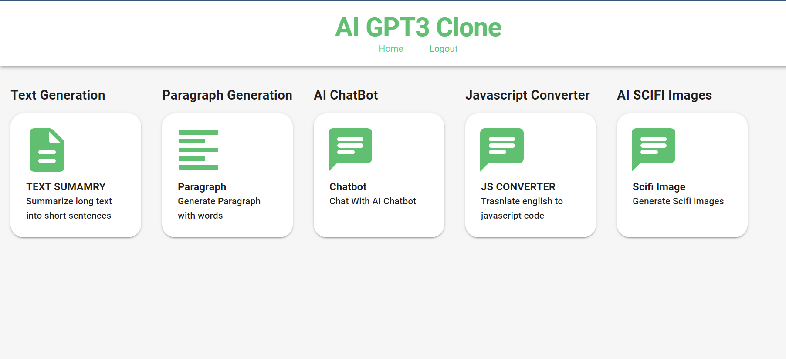
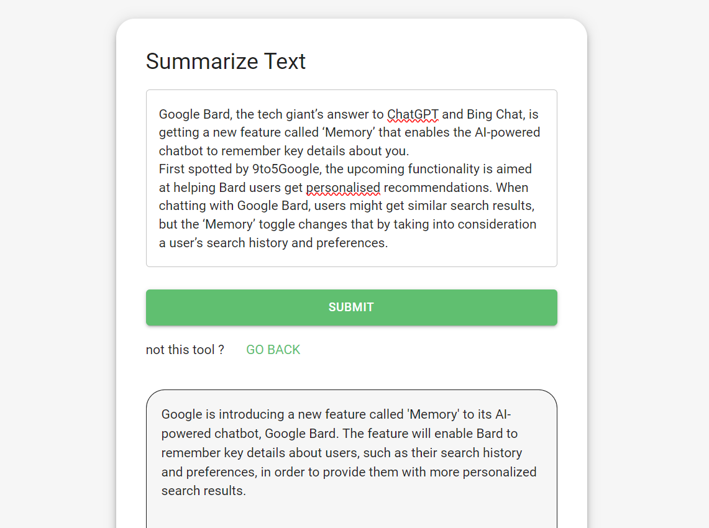
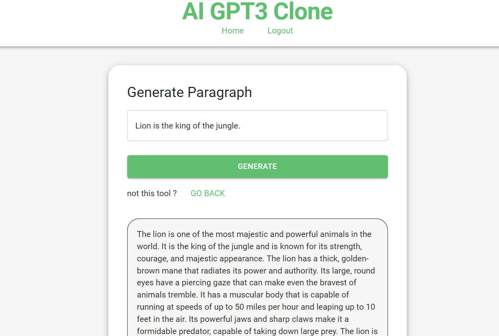
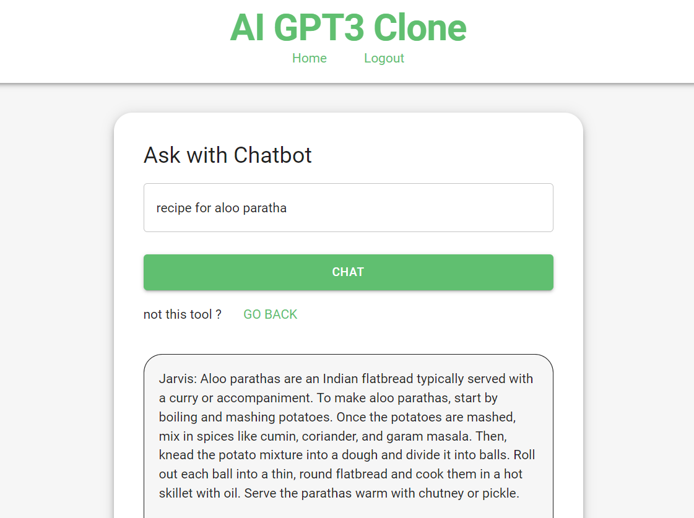
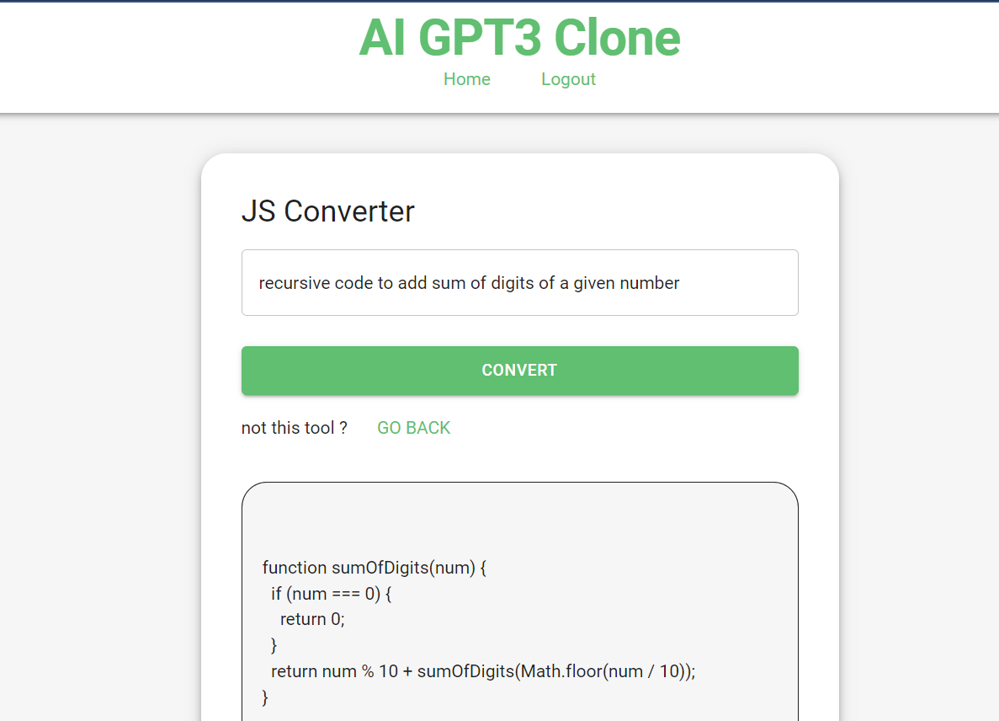
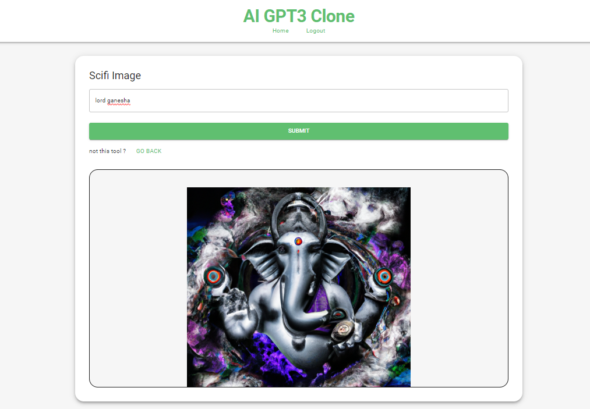

# AIChatbot with GPT-3 Integration

Welcome to our AI-powered Chatbot website! This project combines the capabilities of MERN Stack with the cutting-edge GPT-3 technology to provide an interactive and intelligent chat experience.

## Features

- **AIChatbot:** Experience a fully functional chatbot powered by GPT-3, capable of engaging conversations and providing insightful responses.

- **MERN Stack Integration:** Leveraging the power of MongoDB, Express.js, React, and Node.js for a seamless and efficient full-stack development experience.

- **User Authentication:** Robust user authentication mechanisms are in place to ensure secure access to the chatbot. This includes hashed passwords, token generation, and cookie management for a reliable and secure user experience.

- **Database Modeling:** MongoDB is utilized for efficient and streamlined database modeling, guaranteeing data integrity and scalability.

- **Validation Techniques:** Server-side validation techniques are implemented to ensure data integrity, and client-side routing is optimized to enhance the overall user experience.

## Technologies Used

- **Frontend:** React.js
- **Backend:** Node.js, Express.js
- **Database:** MongoDB
- **AI Integration:** GPT-3

## Getting Started

1. Clone the repository:

   git clone https://github.com/your-username/chat-gpt-clone.git
   
2. Navigate to the project directory:

cd chat-gpt-clone

3. Install dependencies:
   
npm install

4. Set up environment variables:
Create a .env file in the root directory and add the necessary environment variables for database connection, GPT-3 API key, etc.

5. Run the application:
npm start
This will start both the frontend and backend servers.

Open your browser and visit http://localhost:3000 to interact with the AIChatbot.

## Screenshots
# Register

# Login

# Home page

# Function- summarize text page

# Function- Generate paragraph page

# Function- Chatbot page

# Function- javascript code generation  page

# Function- image generation page

Acknowledgments
Special thanks to OpenAI for their incredible GPT-3 technology.
The MERN Stack community for providing robust tools and frameworks.
Happy chatting
